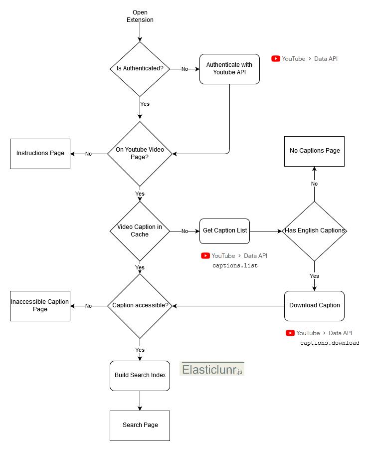

# InnerTube

This is the repository for an Chrome Extension that allows searching Youtube videos based on their captions.

Included is a [presentation](presentation.pdf) describing the project.

## Installation

This extension is entirely self contained and does not require any other servers to run. To use it you will need:
- Google Chrome.
- A Google account.

To install this in Google Chrome, please open it and then:
- Navigate to chrome://extensions​
- Expand the Developer dropdown menu and click “Load Unpacked Extension”​
- Navigate to the local folder containing the extension’s code and click Ok​
- Assuming there are no errors, the extension should load into your browser

Above instructions are from [this](https://superuser.com/questions/247651/how-does-one-install-an-extension-for-chrome-browser-from-the-local-file-system) superuser response.

Once installed, click the extension. This should trigger the authentication flow. (Note that the [captions.download](https://developers.google.com/youtube/v3/docs/captions/download) requires some unusally high level of permissions. This extension will only use the captions.list and captions.download endpoints, and not use your data in any other way. In addition the tokens are only stored in your Chrome browser, and are not sent to any non-Google services).

After authenticating, you can navigate to a Youtube video. Clicking the extension will cause it to download the captions, and prepare a search index. If the video allows third party downloads of captions you should then be presented with a search page. Typing into the search bar will automatically search the video. Clicking a search result will take you to the portion of the video for that captions section.

For authentication we are using [`chrome.identity`](https://developer.chrome.com/apps/identity) package. If you want to change the client ID :

- Make sure the zip you are trying to upload doesn't contain `key` in the `manifest.json`
- Follow [Official Google Chrome Extension Documentation](https://developer.chrome.com/extensions/tut_oauth#upload_to_dashboard). Here, you need to save the application as draft so that you can obtain the public `key` from the dashboard. Add this in manifest.json. [Example manifest.json#L30](https://github.com/kyledemeule/innertube/blob/672d5c64f555cbd6b23626fe0fd7f3a80cd3bc03/manifest.json#L30)
- Create OAuth [Client ID](https://developer.chrome.com/extensions/tut_oauth#oauth_client). Use the Chrome app ID in the `chrome://extensions` in the Application ID. One the Client ID is generated, edit your manifest.json to update your new client ID. [Example manifest.json#L27](https://github.com/kyledemeule/innertube/blob/672d5c64f555cbd6b23626fe0fd7f3a80cd3bc03/manifest.json#L27)
- Go to `chrome://extensions` and reload the Innertube App. Now you can go to any supported youtube video and search the captions using Innertube with new client ID.

Some videos that allow third party caption downloads:
- [How Turbochargers Work](https://www.youtube.com/watch?v=zenMEj0cAC4)
- [Camera Review](https://www.youtube.com/watch?v=70F_S_s5fBw)
- [Differential Equations](https://www.youtube.com/watch?v=p_di4Zn4wz4)
- [Natural Language Content Analysis](https://www.youtube.com/watch?v=p_di4Zn4wz4)
- [Learning Sentiment Lexicons](https://www.youtube.com/watch?v=Ogm5E2JNCzg)

## Implementation

A general overview of the major files:
- `manifest.json`: Includes configuration information that describes the application
- `views/popup.html`: HTML of the major popup. Has "pages" that are shown or hidden based on current state of the extension.
- `scripts/popup.js`: Majority of logic of the application. Executes in the context of `popup.html` only, not the Youtube page. Handles authentication, interaction with Youtube Data API, index building, processing search results, and trigger Youtube Player seeks.
- `scripts/content.js`: This is the Javascript that executes in the Youtubes DOM. However it does not have access to the objects the Youtubes Javascript has implemented (e.g. the Youtube iFrame Player to perform `seekTo()`). To run code completely in Youtubes context, this content will injext scripts in to the page.

A flowchart of what happens when the plugin is opened:

Overall it handles:
- Authentication
- Ensuring we're on Youtube
- Download caption
- Create search index
- Show search page

When a search is entered, `popup.js` will grab the value of the input field, run it throught he search index, and populate a `<dl>` with the ordered search results.

When a search result is clicked, `popup.js` will get the start time of the selection, convert it to seconds, send the seconds to `content.js`, and `content.js` will inject code to run `seekTo()` on the player in the Youtube page.

The following technologies are used:
- [Chrome Extensions](https://developer.chrome.com/extensions/devguide)
- [Youtube Data API](https://developers.google.com/youtube/v3)
- [Youtube iFrame Player API](https://developers.google.com/youtube/iframe_api_reference)
- [Elasticlunr.js](http://elasticlunr.com/)
- [jQuery](https://jquery.com/)
- [Google API Client Library for JavaScript](https://github.com/google/google-api-javascript-client)

### Search Index

The search index is built using [elasticlunr.js](http://elasticlunr.com/). It implements a ranking algorithm that utilizes TF/IDF and a vector space model. We also incorporate stop word filtering (i.e. remove common english words), and stemming (reduce related words to their stems, e.g. running -> run).

A possible expansion to the index is to use token expansion (expand small words, e.g. auto -> autofocus), but we don't include that currently.

